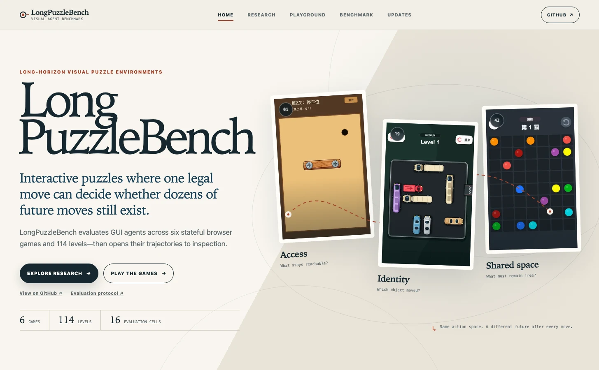
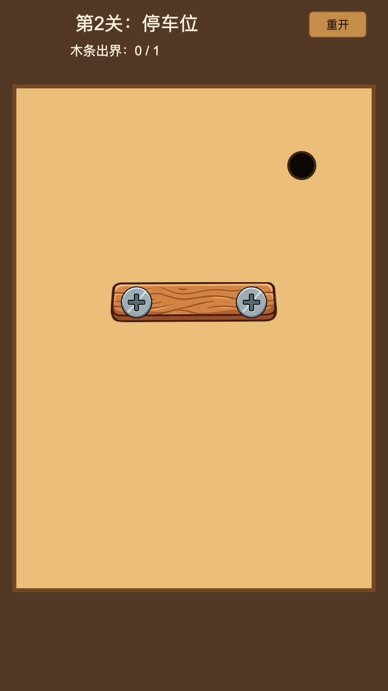
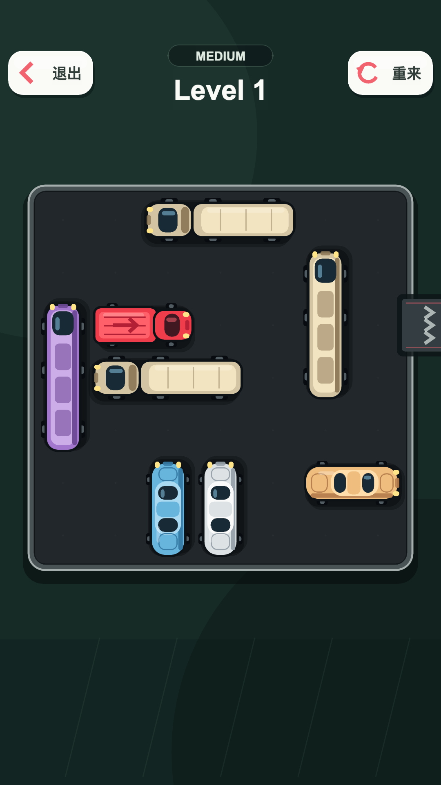
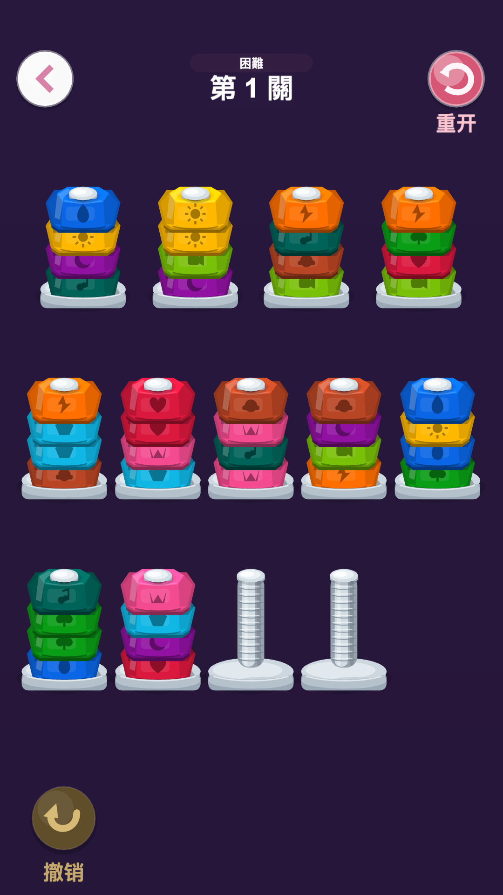
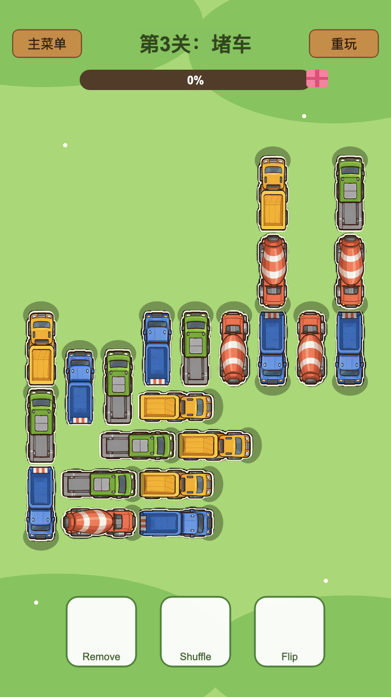
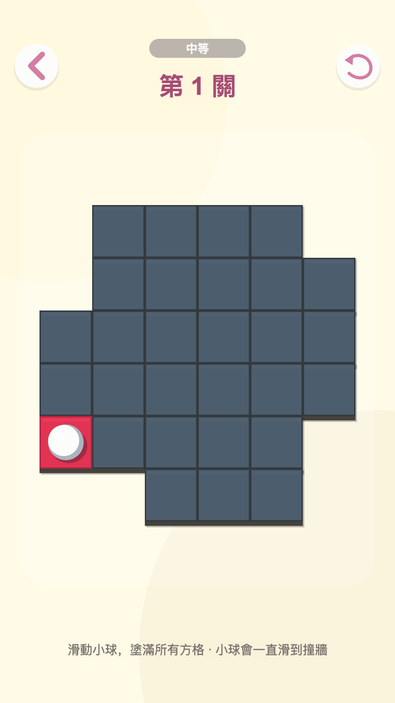
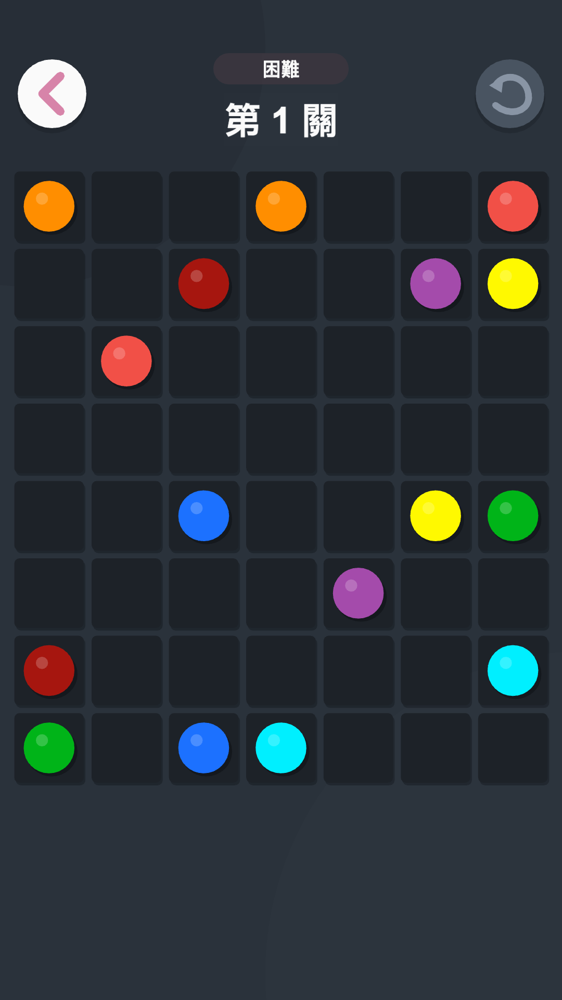
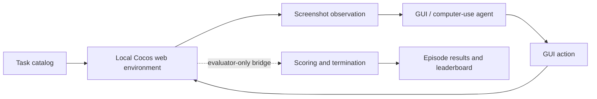

<div align="center">

# LongPuzzleBench

**Long-horizon visual puzzle-game evaluation for GUI and computer-use agents**

[](LICENSE)
[](https://github.com/AzureStarz/LongPuzzleBench/actions/workflows/ci.yml)
[](pyproject.toml)
[](#game-environments)
[](#game-environments)

[Project homepage](https://azurestarz.github.io/LongPuzzleBench/) · [Play in browser](https://azurestarz.github.io/LongPuzzleBench/play/) · [Research note](https://azurestarz.github.io/LongPuzzleBench/research/) · [Quick start](#quick-start) · [Leaderboard](#leaderboard) · [Evaluation protocol](#evaluation-protocol)



</div>

## Overview

LongPuzzleBench evaluates whether GUI agents can sustain coherent visual reasoning and precise interaction across extended puzzle trajectories. Its browser environments require agents to observe changing boards, preserve state across many actions, plan ahead, localize relevant objects, recover from ineffective moves, and adapt their strategy as the scene evolves.

The initial release contains **6 puzzle environments, 114 levels, and 16 game × difficulty evaluation cells**. Every environment runs locally from the bundled browser build; the agent receives screenshots and public action feedback, while evaluator-only state stays on a separate scoring path.

**Want to feel the benchmark before installing it?** Open the [public human playground](https://azurestarz.github.io/LongPuzzleBench/play/) to try 13 curated levels across all six game families. It runs entirely on GitHub Pages and clearly separates the human exhibit from the full agent evaluation set.

## Why long-horizon puzzle games?

Many GUI-agent evaluations emphasize short tasks or workflows. Puzzle games create controlled, repeatable trajectories in which progress depends on a sequence of interlocking decisions rather than a single correct click. LongPuzzleBench targets capabilities that become visible over these longer horizons:

- persistent state tracking across visual changes;
- visual grounding, localization, and spatial reasoning;
- multi-step planning and action sequencing;
- precise clicking, dragging, swiping, and timing;
- recovery from invalid or ineffective interactions;
- adaptation to dynamic boards and delayed consequences;
- maintaining a coherent strategy throughout an extended episode.

## Benchmark highlights

| Property | Release setting |
| --- | --- |
| Environments | 6 deterministic browser puzzle games |
| Evaluation set | 114 levels across 16 game × difficulty cells |
| Observation | Cropped game screenshots plus least-privilege action feedback |
| Actions | Click, double-click, long press, press/release, drag, swipe, and wait |
| Protocol | Full or minimal task instructions; progressive or all-level execution |
| Scoring | Per-level normalized score in `[0, 100]`; official 16-cell macro average |
| Reproducibility | Repository-relative config, bundled web build, fixed catalog, seed `0` |
| Agent interface | Built-in OpenAI-compatible baseline or a custom Python `BaseAgent` |

## Game environments

<table>
<tr>
<td align="center"><br/><b>Bolt Unscrew</b><br/>Physics and relocation planning</td>
<td align="center"><br/><b>Rush Hour</b><br/>Constrained spatial rearrangement</td>
<td align="center"><br/><b>Nut and Bolt</b><br/>Stack sorting and look-ahead</td>
</tr>
<tr>
<td align="center"><br/><b>Truck Escape</b><br/>Ordering and dependency planning</td>
<td align="center"><br/><b>Maze Paint</b><br/>Coverage planning under movement constraints</td>
<td align="center"><br/><b>Color Connect</b><br/>Non-overlapping route construction</td>
</tr>
</table>

| Environment | Interaction | Difficulties | Levels |
| --- | --- | --- | ---: |
| Bolt Unscrew | Click | Easy, Hard | 16 |
| Rush Hour | Drag | Easy, Medium, Hard | 30 |
| Nut and Bolt | Click | Easy, Medium, Hard, Extreme, Nightmare | 13 |
| Truck Escape | Click | Default | 5 |
| Maze Paint | Swipe | Easy, Medium, Hard | 30 |
| Color Connect | Click | Easy, Hard | 20 |
| **Total** |  | **16 cells** | **114** |

## How it works



The browser adapter launches a level with deterministic query parameters, crops the game canvas, and dispatches GUI actions through Playwright. The agent never receives the private benchmark bridge or raw evaluator state. That state is read only by the evaluator to determine progress, terminal conditions, diagnostics, and the final score.

## Quick start

### Requirements

- Python **3.12**
- [`uv`](https://docs.astral.sh/uv/)
- Chromium installed through Playwright
- Node.js **22+** only when running the game-model tests or editing game source

Clone the repository and install the locked environment:

```bash
git clone https://github.com/AzureStarz/LongPuzzleBench.git
cd LongPuzzleBench
uv sync --extra dev --locked
uv run playwright install chromium
```

Verify the bundled game without an API key:

```bash
uv run longpuzzlebench play \
  --game bolt_unscrew \
  --difficulty easy \
  --level 1 \
  --headless \
  --check \
  --screenshot artifacts/bolt-smoke.png
```

Validate an evaluation plan without calling a model:

```bash
uv run longpuzzlebench eval \
  --game bolt_unscrew \
  --difficulty easy \
  --dry-run \
  --output results/dry-run
```

## Running an evaluation

The maintained baseline uses the official OpenAI Python SDK and supports OpenAI or OpenAI-compatible endpoints. Copy the environment template, set your own credentials locally, and load it into the shell:

```bash
cp .env.example .env
# Edit .env, then:
set -a
source .env
set +a
```

Run one formal game × difficulty cell:

```bash
uv run longpuzzlebench eval \
  --game bolt_unscrew \
  --difficulty easy \
  --model "$LONGPUZZLEBENCH_MODEL" \
  --reasoning-effort medium \
  --output results/bolt-unscrew-easy
```

A formal invocation runs every configured level in the selected cell. In the default **progressive** protocol, the next level unlocks only after success; levels skipped after a failure contribute zero to the complete configured denominator.

Run all 16 cells and produce merged leaderboard files:

```bash
LONGPUZZLEBENCH_OUTPUT=results/my-model \
  ./scripts/evaluate_all.sh \
  --model "$LONGPUZZLEBENCH_MODEL" \
  --reasoning-effort medium
```

To evaluate another agent implementation, pass a Python file containing exactly one `BaseAgent` subclass:

```bash
uv run longpuzzlebench eval \
  --game color_connect \
  --difficulty hard \
  --agent path/to/custom_agent.py \
  --output results/custom-agent/color-connect-hard
```

Use `uv run longpuzzlebench eval --help` for the complete set of model, history, timeout, hosted-game, and rebuild options.

## Evaluation protocol

1. The catalog selects one game × difficulty cell and expands its configured levels and seeds.
2. Each level starts in a fresh browser context with deterministic launch parameters.
3. The agent receives the current screenshot and public feedback from its preceding action.
4. The harness enforces step, play-time, invalid-action, and no-progress limits.
5. The evaluator reads isolated game state, normalizes the game-specific metric, and writes machine-readable artifacts.
6. Cell and benchmark scores are aggregated offline from the recorded episodes and complete run plan.

The released leaderboard uses `prompt_setting=full`, `eval_mode=progressive`, and seed `0`. Task instructions are part of the versioned catalog in [`configs/longpuzzlebench.json`](configs/longpuzzlebench.json).

## Metrics

- **Level score (`0–100`)** — normalized game-specific success and progress score. Higher is better.
- **Success rate** — successful levels divided by all planned levels; skipped progressive levels remain in the denominator.
- **Cell score** — mean level score for one game × difficulty cell.
- **LongPuzzleBench score** — unweighted macro average of all **16** cell scores. A run must cover every configured cell to be ranked.

This aggregation prevents games with more levels from dominating the benchmark while preserving the consequence of failing early in a progressive trajectory.

## Leaderboard

<!-- LEADERBOARD:START -->

> **Evaluation snapshot · August 28, 2026**<br>
> 18 complete runs · 6 games · 114 levels · 16/16 cells · full instructions · progressive evaluation · seed 0

<table>
<tr>
<td align="center" width="33%">
<strong>🥇 1st</strong><br/>
<code>gpt-5.6-sol</code><br/>
<sub>medium reasoning</sub><br/><br/>
<strong>54.796</strong><br/>
<sub>55.42% success</sub>
</td>
<td align="center" width="33%">
<strong>🥈 2nd</strong><br/>
<code>gpt-5.6-sol</code><br/>
<sub>low reasoning</sub><br/><br/>
<strong>54.142</strong><br/>
<sub>55.62% success</sub>
</td>
<td align="center" width="33%">
<strong>🥉 3rd</strong><br/>
<code>gpt-5.6-sol</code><br/>
<sub>high reasoning</sub><br/><br/>
<strong>49.968</strong><br/>
<sub>50.47% success</sub>
</td>
</tr>
</table>

**Primary metric:** LongPuzzleBench score (`0–100`, higher is better), computed as the unweighted macro average over all 16 game × difficulty cells.

| Rank | Model | Reasoning | Score ↑ | Success rate |
| :---: | --- | :---: | ---: | ---: |
| 🥇 1 | **`gpt-5.6-sol`** | `medium` | **54.796** | **55.42%** |
| 🥈 2 | **`gpt-5.6-sol`** | `low` | **54.142** | **55.62%** |
| 🥉 3 | **`gpt-5.6-sol`** | `high` | **49.968** | **50.47%** |
| 4 | `gpt-5.6-terra` | `high` | 47.591 | 48.75% |
| 5 | `gpt-5.6-terra` | `medium` | 37.772 | 38.18% |
| 6 | `gpt-5.6-terra` | `low` | 36.806 | 37.29% |
| 7 | `kimi-k3` | `high` | 32.694 | 32.50% |
| 8 | `gpt-5.6-luna` | `high` | 30.337 | 31.25% |
| 9 | `gpt-5.6-luna` | `medium` | 24.158 | 23.75% |
| 10 | `gpt-5.6-luna` | `low` | 17.867 | 16.04% |

<details>
<summary><strong>View ranks 11–18</strong></summary>

| Rank | Model | Reasoning | Score ↑ | Success rate |
| :---: | --- | :---: | ---: | ---: |
| 11 | `qwen/qwen3.8-27b` | — | 16.915 | 16.25% |
| 12 | `moonshotai/kimi-k2.5` | `max` | 15.979 | 15.47% |
| 13 | `qwen/qwen3.5-122b-a10b` | — | 11.285 | 10.10% |
| 14 | `qwen/qwen3.6-35b-a3b` | — | 6.580 | 5.68% |
| 15 | `qwen/qwen3.5-397b-a17b` | — | 6.471 | 4.84% |
| 16 | `z-ai/glm-4.6v` | `max` | 6.386 | 5.47% |
| 17 | `qwen/qwen3-vl-235b-a22b-thinking` | — | 5.314 | 3.59% |
| 18 | `qwen/qwen3-vl-30b-a3b-thinking` | — | 5.134 | 4.43% |

</details>

This refresh adds complete `gpt-5.6-terra` (`high`) and `kimi-k3` (`high`) runs and incorporates the latest complete `gpt-5.6-sol` (`high`) result. Machine-readable data—including every per-game and per-cell score—is available in [`leaderboard/results.json`](leaderboard/results.json) and [`leaderboard/results.csv`](leaderboard/results.csv). Incomplete runs are excluded rather than zero-padded into the public ranking.

<!-- LEADERBOARD:END -->

## Repository structure

```text
.
├── index.html               # Static research-project homepage
├── assets/                  # Shared site shell, homepage code, and real game previews
├── blog/                    # Trajectory-analysis research story
├── playground/              # Human-facing game gallery and launcher
├── configs/longpuzzlebench.json # Versioned task catalog and protocol
├── games/puzzle_suite/      # Cocos source, prebuilt web bundle, game tests
├── leaderboard/             # Sanitized public benchmark results
├── scripts/evaluate_all.sh  # Complete 16-cell evaluation helper
├── src/mobile_world/        # MobileWorld-derived, puzzle-only harness
└── tests/                   # Unit and real-browser integration coverage
```

The internal Python package retains the `mobile_world` namespace to preserve provenance and avoid a breaking cosmetic rewrite. Public commands, configuration, labels, and documentation use **LongPuzzleBench**.

## Adding new games

New environments should remain long-horizon interactive games with deterministic task selection and evaluator-isolated state. A game contribution should:

1. implement the browser bridge contract used by [`BenchmarkBridge.ts`](games/puzzle_suite/assets/scripts/game/BenchmarkBridge.ts);
2. expose stable game, difficulty, level, and seed launch parameters;
3. define terminal state, progress metrics, and legal interaction semantics;
4. add catalog entries and scoring configuration;
5. include model-level tests and a real-browser launch check;
6. update the bundled web build, previews, notices, and environment counts.

## Roadmap

LongPuzzleBench will scale with additional long-horizon interactive game environments. Planned dimensions include more puzzle families, longer trajectories, richer visual dynamics, higher interaction complexity, more diverse reasoning patterns, and stronger generalization across unseen layouts and mechanics.

## Research note

**[Read: “The Move Was Legal. The Puzzle Was Already Lost.”](https://azurestarz.github.io/LongPuzzleBench/research/)**

The interactive research note analyzes 782 executed trajectories across the 18 complete public
runs. It reconstructs environment-level failures: irreversible loss of future actions, sticky
selection after rejected destinations, cross-path corridor conflicts, stale maze localization, and
part–whole vehicle confusion. Its figures and trace frames are reproducible with
[`scripts/analyze_blog_trajectories.py`](scripts/analyze_blog_trajectories.py).

The self-contained article source and sanitized evidence bundle are available under
[`blog/longpuzzlebench-agents/`](blog/longpuzzlebench-agents/).

## Technical report

**Technical report coming soon.**

Citation metadata will be published with the report. No provisional paper title, author list, or venue is assigned in this release.

## Acknowledgements

The evaluation harness is adapted from [MobileWorld](https://github.com/Tongyi-MAI/MobileWorld). LongPuzzleBench retains the upstream `mobile_world` Python namespace and Apache-2.0 attribution while replacing the Android task stack with:

- a Playwright/Cocos browser-game adapter;
- benchmark-specific task catalogs and launch parameters;
- evaluator-isolated state and scoring;
- progressive long-horizon execution and no-progress safeguards;
- puzzle environments and public leaderboard artifacts.

The upstream Android environments, private evaluation services, credentials, deployment data, and backend infrastructure are not part of this repository. The game suite was integrated from the [`hongbin` branch of Bolt Unscrew](https://github.com/adf1178/Bolt_Unscrew/tree/hongbin) and expanded for this benchmark. See [`NOTICE`](NOTICE), [`games/puzzle_suite/NOTICE.md`](games/puzzle_suite/NOTICE.md), and [`THIRD_PARTY_NOTICES.md`](THIRD_PARTY_NOTICES.md).

## License

LongPuzzleBench-authored material is released under the [Apache License 2.0](LICENSE). Imported game material and third-party runtime components remain subject to their respective rights and notices in [`games/puzzle_suite/NOTICE.md`](games/puzzle_suite/NOTICE.md) and [`THIRD_PARTY_NOTICES.md`](THIRD_PARTY_NOTICES.md).
