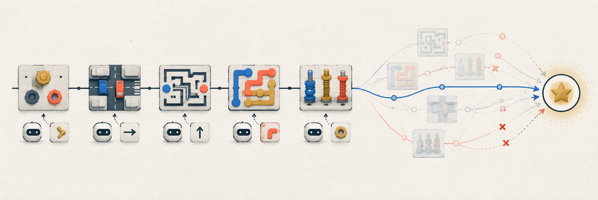
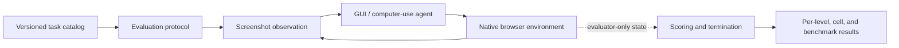

<div align="center">

# LongPuzzleBench

**Evaluating GUI agents on long-horizon visual puzzles**

[](https://arxiv.org/abs/2609.34769)
[](https://azurestarz.github.io/LongPuzzleBench/)
[](https://azurestarz.github.io/LongPuzzleBench/play/)
[](https://github.com/AzureStarz/LongPuzzleBench/actions/workflows/ci.yml)
[](LICENSE)
[](pyproject.toml)
[](#game-environments)
[](#game-environments)
[](#evaluation-design)
[](https://github.com/AzureStarz/LongPuzzleBench)
[](https://github.com/AzureStarz/LongPuzzleBench/stargazers)

<br />

<a href="https://arxiv.org/abs/2609.34769">📄 Read the paper</a> · <a href="https://azurestarz.github.io/LongPuzzleBench/">🌐 Visit the website</a> · <a href="https://azurestarz.github.io/LongPuzzleBench/play/">🎮 Play the benchmark</a> · <a href="docs/evaluation.md">⚙️ Run an evaluation</a>

<br /><br />



<sub>Six browser puzzle families · 114 levels · long-horizon GUI evaluation · reproducible local runtime</sub>

</div>

## Project entry points

<table>
<tr>
<td align="center" width="25%"><a href="https://arxiv.org/abs/2609.34769"><strong>📄 Paper</strong></a><br /><sub>Scientific reference and main findings</sub></td>
<td align="center" width="25%"><a href="https://azurestarz.github.io/LongPuzzleBench/"><strong>🌐 Website</strong></a><br /><sub>Benchmark overview and results</sub></td>
<td align="center" width="25%"><a href="https://azurestarz.github.io/LongPuzzleBench/play/"><strong>🎮 Playground</strong></a><br /><sub>Try curated levels in your browser</sub></td>
<td align="center" width="25%"><a href="docs/evaluation.md"><strong>⚙️ Evaluation</strong></a><br /><sub>Protocols, agents, and commands</sub></td>
</tr>
</table>

> **Release snapshot** · 6 deterministic games · 114 levels · 16 evaluation cells · Autonomous Evaluation as the recommended paper-facing protocol.

## What is LongPuzzleBench?

LongPuzzleBench is a benchmark for visual reasoning and computer-use agents that must preserve a workable plan across long, changing GUI trajectories. It contains six deterministic browser puzzle games, 114 levels, and 16 game × difficulty evaluation cells. A legal move can improve the visible board while removing the only option needed several steps later; the benchmark makes that failure measurable.

The benchmark evaluates persistent state tracking, visual grounding, multi-step planning, precise interaction, recovery from ineffective actions, and adaptation to delayed consequences. Agents receive screenshots and public action feedback. Evaluator-only state remains on a separate scoring path.

The accompanying paper, [*LongPuzzleBench: Evaluating GUI Agents on Long-Horizon Visual Puzzles*](https://arxiv.org/abs/2609.34769), defines the research setting and reports the main findings. The release keeps the paper, code, catalog, browser environments, and machine-readable results aligned.

## 🔭 Benchmark at a glance

| Component | Release definition |
| --- | --- |
| Environments | Bolt Unscrew, Rush Hour, Nut and Bolt, Truck Escape, Maze Paint, Color Connect |
| Tasks | 114 levels across 16 game × difficulty cells |
| Observation | Cropped game screenshots plus public action feedback |
| Actions | Click, double-click, long press, press/release, drag, swipe, wait |
| Score | Normalized per-level score in `[0, 100]`; unweighted macro average over 16 cells |
| Reproducibility | Bundled browser build, versioned catalog, fixed seed `0` |

## 🧪 Evaluation design

**Autonomous Evaluation is the recommended and paper-facing protocol.** The agent starts at the native game hub, selects the target game and difficulty, plays the complete cell, and recovers through the interface. The paper's main results use this full-lifecycle setting.

The repository also supports the controlled catalog harness and two Codex-compatible GUI pathways. Their names and contracts are defined by the implementation:

| Setting | Command / agent | Contract |
| --- | --- | --- |
| Autonomous visual baseline | `longpuzzlebench autonomous --agent autonomous_visual` | Screenshot observations and parsed GUI actions |
| Autonomous code-execution CUA | `longpuzzlebench autonomous --agent autonomous_tools` | Responses API tools; default `code_execution` uses persistent `cua_repl` |
| Autonomous structured GUI | `longpuzzlebench autonomous --agent autonomous_gui` | Structured Computer Tool `action` envelope |
| Controlled evaluation harness | `longpuzzlebench eval` | Fixed catalog cell, deterministic launch, public feedback, offline scoring |
| Codex App native runner | `scripts/gui_game_benchmark.py` | Codex App `code_execution` or `structured_computer_tool` sessions |

`autonomous_tools --tool-execution-mode legacy|batched` remains available for historical comparisons. The implementation details, output schema, and examples live in [`docs/evaluation.md`](docs/evaluation.md), [`docs/autonomous-evaluation.md`](docs/autonomous-evaluation.md), and [`docs/harness-cua-alignment.md`](docs/harness-cua-alignment.md).


```mermaid
flowchart LR
    T[Versioned task catalog] --> H[Evaluation protocol]
    H --> O[Screenshot observation]
    O --> A[GUI / computer-use agent]
    A --> E[Native browser environment]
    E --> O
    E -. evaluator-only state .-> S[Scoring and termination]
    S --> R[Per-level, cell, and benchmark results]
```

## 🚀 Quick start

Requirements: Python 3.12, [`uv`](https://docs.astral.sh/uv/), and Chromium installed through Playwright.

```bash
git clone https://github.com/AzureStarz/LongPuzzleBench.git
cd LongPuzzleBench
uv sync --extra dev --locked
uv run playwright install chromium
```

Run the recommended autonomous smoke evaluation with a local model configuration:

```bash
cp .env.example .env
# Edit .env, then:
set -a && source .env && set +a
uv run longpuzzlebench autonomous \
  --agent autonomous_tools \
  --game bolt_unscrew --difficulty easy \
  --model "$LONGPUZZLEBENCH_MODEL" \
  --timeout 300 \
  --output results/autonomous/smoke
```

Run a no-model browser check and validate a catalog plan:

```bash
uv run longpuzzlebench play --game bolt_unscrew --difficulty easy --level 1 --headless --check
uv run longpuzzlebench eval --game bolt_unscrew --difficulty easy --dry-run --output results/dry-run
```

Use `uv run longpuzzlebench autonomous --help` and [`docs/evaluation.md`](docs/evaluation.md) for provider profiles, structured GUI settings, batch runs, custom `BaseAgent` integrations, and regrading.

## 🎮 Game environments

| Environment | Core challenge | Difficulties | Levels |
| --- | --- | ---: | ---: |
| Bolt Unscrew | Access and physics | Easy, Hard | 16 |
| Rush Hour | Spatial rearrangement | Easy, Medium, Hard | 30 |
| Nut and Bolt | Stack ordering and look-ahead | Easy, Medium, Hard, Extreme, Nightmare | 13 |
| Truck Escape | Dependency ordering | Default | 5 |
| Maze Paint | Coverage under movement constraints | Easy, Medium, Hard | 30 |
| Color Connect | Non-overlapping route construction | Easy, Hard | 20 |
| **Total** |  | **16 cells** | **114** |

Try curated human levels in the [browser playground](https://azurestarz.github.io/LongPuzzleBench/play/). The exhibit uses the same checked-in game runtime and mechanics while omitting evaluator-only state, agent limits, and private diagnostics.

## 📊 Results

The public leaderboard is generated from complete runs with `prompt_setting=full`, `eval_mode=progressive`, seed `0`, and all 16 cells covered. The current snapshot includes 18 complete configurations; the primary metric is the unweighted macro average of cell scores. See [`leaderboard/results.json`](leaderboard/results.json) for per-game and per-cell values and the [project website](https://azurestarz.github.io/LongPuzzleBench/#benchmark) for a visual overview.

## 🗂️ Repository structure

```text
.
├── configs/longpuzzlebench.json   # Versioned catalog, seeds, limits, and scoring
├── src/mobile_world/               # Python package: CLI, agents, runtime, evaluators
├── games/puzzle_suite/             # Cocos source and bundled browser environment
├── playground/                     # Human-facing browser gallery and launcher
├── assets/                         # Static website shell, previews, and diagrams
├── scripts/                        # Evaluation, batch, recording, and analysis tools
├── docs/                           # Evaluation, metrics, lifecycle, and contribution notes
├── leaderboard/                    # Sanitized public results
├── tests/                          # Unit and browser integration coverage
└── blog/                           # Reproducible trajectory research note
```

Research process artifacts, local trajectories, caches, and generated outputs stay outside the release surface through `.gitignore`; benchmark catalogs, game source, scoring logic, tests, and sanitized result summaries remain versioned.

## 🛠️ Development and contribution

```bash
uv run pytest -q
uv run ruff check src tests scripts
```

New environments must expose stable game, difficulty, level, and seed parameters; implement the evaluator bridge and normalized score; add catalog entries and model-level tests; pass a browser launch check; and update the bundled runtime and previews. See [`CONTRIBUTING.md`](CONTRIBUTING.md) when present, or open an issue with a proposed task definition.

## 📚 Citation

```bibtex
@article{zhang2026longpuzzlebench,
  title   = {LongPuzzleBench: Evaluating GUI Agents on Long-Horizon Visual Puzzles},
  author  = {Zhang, Bingo and Lu, Haochuan and Li, Zongjie and Li, Genjian and Zhang, Ari Yu and Wang, Chaozheng},
  journal = {arXiv preprint arXiv:2609.34769},
  year    = {2026},
  doi     = {10.48550/arXiv.2609.34769}
}
```

See [`CITATION.cff`](CITATION.cff) for machine-readable metadata.

## ⚖️ License and acknowledgements

LongPuzzleBench-authored material is released under the [Apache License 2.0](LICENSE). Imported game material and runtime components retain their respective notices in [`games/puzzle_suite/NOTICE.md`](games/puzzle_suite/NOTICE.md), [`NOTICE`](NOTICE), and [`THIRD_PARTY_NOTICES.md`](THIRD_PARTY_NOTICES.md).

The evaluation harness is adapted from [MobileWorld](https://github.com/Tongyi-MAI/MobileWorld). The puzzle suite includes material integrated from the [`hongbin` branch of Bolt Unscrew](https://github.com/adf1178/Bolt_Unscrew/tree/hongbin); provenance and third-party licenses are listed in the repository notices.
